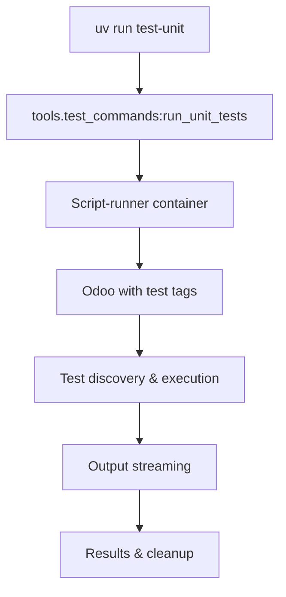

# Testing Guide

## Overview

This project uses a modern UV-based test infrastructure with Odoo 18's testing framework. The system provides three test
layers with clean separation and reliable execution.

**Test Statistics**: Run `uv run test-stats` for current counts  
**Total Runtime**: < 30 minutes for complete suite  
**Infrastructure**: Uses script-runner container to avoid circular imports

## Advanced Testing Documentation

For comprehensive testing patterns including:
- Computed fields with cache management
- Security and access rights testing
- Multi-company scenarios
- Performance testing

See: [Advanced Testing Patterns](odoo18/TESTING_ADVANCED.md)

## Quick Start

### ⚠️ CRITICAL: Always Use `uv run` Commands

**NEVER run test scripts directly!** The test infrastructure requires `uv run`:

- ✅ **CORRECT**: `uv run test-unit`
- ❌ **WRONG**: `python tools/test_runner.py`
- ❌ **WRONG**: `.venv/bin/python tools/test_runner.py`

### Simple Commands (Recommended)

```bash
# Core test commands (these just work!)
uv run test-unit          # Fast unit tests (< 2 min)
uv run test-integration   # Integration tests (< 10 min)  
uv run test-tour          # Browser UI tests (< 15 min)
uv run test-all           # Complete test suite (< 30 min)
uv run test-quick         # Quick verification tests
uv run test-stats         # Show test statistics

# Test utilities
uv run test-setup         # Initialize test databases
uv run test-clean         # Remove test artifacts  
uv run test-report        # Generate HTML report
# uv run test-watch       # TDD watch mode (not yet implemented)
```

**That's it!** These commands handle all the complexity internally.

### What Makes This Work

- **Script-runner container**: Avoids circular import issues
- **Automatic database management**: Fresh databases as needed
- **Test tags**: `unit_test`, `integration_test`, `tour_test`
- **Output streaming**: Real-time progress updates
- **Error handling**: Clean failures with actionable feedback

## Test Types

### Unit Tests (`unit_test` tag)

- **Purpose**: Fast, isolated business logic testing
- **Runtime**: < 2 minutes
- **Database**: Fresh database per run
- **Examples**: Model validation, computed fields, constraints

### Integration Tests (`integration_test` tag)

- **Purpose**: Service layer and API integration testing
- **Runtime**: < 10 minutes
- **Database**: Stable test database with snapshots
- **Examples**: Shopify sync, order import, external API calls

### Tour Tests (`tour_test` tag)

- **Purpose**: End-to-end browser workflow testing
- **Runtime**: < 15 minutes (with automatic hang detection)
- **Database**: Production database clone for realistic testing
- **Examples**: UI interactions, complete user workflows
- **Features**: Pattern detection prevents hanging, Chrome process cleanup

## Writing Tests

### 1. Choose the Right Test Type

```python
# Fast business logic tests
from ..common_imports import tagged, UNIT_TAGS
from ..fixtures import UnitTestCase

@tagged(*UNIT_TAGS)
class TestBusinessLogic(UnitTestCase):
    def test_motor_creation(self):
        # Fast, isolated test
        pass

# Service integration tests
from ..common_imports import tagged, INTEGRATION_TAGS
from ..fixtures import IntegrationTestCase

@tagged(*INTEGRATION_TAGS)
class TestShopifySync(IntegrationTestCase):
    def test_product_sync(self):
        # Real service integration
        pass

# Browser workflow tests
from ..common_imports import tagged, TOUR_TAGS
from ..fixtures import TourTestCase

@tagged(*TOUR_TAGS)
class TestProductWorkflow(TourTestCase):
    def test_product_creation_flow(self):
        # End-to-end browser test
        pass
```

### 2. Use Factory Pattern

```python
from ..fixtures import ProductFactory, PartnerFactory

# ✅ GOOD - Always unique
product = ProductFactory.create(self.env, name="Custom Name")

# ❌ BAD - Will cause conflicts
product = self.env["product.template"].create({
    "default_code": "TEST001",  # Conflicts!
})
```

## Test Tagging System

### Tag Constants (Required)

All tests MUST use tag constants from `base_types.py`:

```python
# Import the constants
from ..common_imports import tagged, UNIT_TAGS, INTEGRATION_TAGS, TOUR_TAGS

# Use them with @tagged decorator
@tagged(*UNIT_TAGS)          # Unit tests
@tagged(*INTEGRATION_TAGS)   # Integration tests  
@tagged(*TOUR_TAGS)          # Tour tests
```

### Tag Definitions

```python
# From base_types.py
STANDARD_TAGS = ["post_install", "-at_install"]
UNIT_TAGS = STANDARD_TAGS + ["unit_test"]
INTEGRATION_TAGS = STANDARD_TAGS + ["integration_test"]
TOUR_TAGS = STANDARD_TAGS + ["tour_test"]
```

### Why Use Constants?

- **Consistency**: Same tags across all tests
- **Discovery**: Test runner finds tests properly
- **Maintenance**: Change tags in one place
- **Type safety**: IDE autocomplete and validation

## Base Test Classes

### UnitTestCase

**Purpose**: Fast, isolated business logic tests

**Features**:

- Fresh database per test class
- Mock support for external services
- Factory pattern for test data
- No external dependencies

**Example**:

```python
from ..common_imports import tagged, UNIT_TAGS
from ..fixtures import UnitTestCase, ProductFactory

@tagged(*UNIT_TAGS)
class TestMotorModel(UnitTestCase):
    def test_motor_creation(self):
        motor = ProductFactory.create_motor(self.env)
        self.assertEqual(motor.product_type, "motor")
        
    def test_validation_rules(self):
        with self.assertRaises(ValidationError):
            ProductFactory.create(self.env, default_code="")
```

### IntegrationTestCase

**Purpose**: Service layer and API integration tests

**Features**:

- Stable test database with snapshots
- Pre-configured mock services
- Real integration testing capabilities
- Shared setup for efficiency

**Example**:

```python
from ..common_imports import tagged, INTEGRATION_TAGS
from ..fixtures import IntegrationTestCase

@tagged(*INTEGRATION_TAGS)
class TestShopifySync(IntegrationTestCase):
    def test_product_sync(self):
        # Create test credentials
        credentials = self.create_shopify_credentials()
        
        # Mock external service
        with self.mock_shopify_client() as mock_client:
            mock_client.query.return_value = self.mock_shopify_response({
                "products": {"edges": []}
            })
            
            # Test the service
            result = self.shopify_service.sync_products()
            self.assertTrue(result.success)
```

### TourTestCase

**Purpose**: Browser-based UI workflow tests

**Features**:

- Production database clone (preserves realistic data)
- Chrome process management and cleanup
- Automatic hang detection with pattern recognition
- Multi-worker HttpCase compatibility
- Environment validation for Chrome/browser setup

**Example**:

```python
from ..common_imports import tagged, TOUR_TAGS
from ..fixtures import TourTestCase

@tagged(*TOUR_TAGS)
class TestProductWorkflow(TourTestCase):
    def setUp(self):
        super().setUp()
        self.browser_size = "1920x1080"  # MUST be string!
        
    def test_product_creation_flow(self):
        self.start_tour("/odoo", "product_creation_tour")
        
    def test_action_validation(self):
        # Alternative pattern: model validation instead of browser automation
        action = self.env.ref("module.action_name")
        self.assertTrue(action, "Action should exist")
        model = self.env[action.res_model]
        self.assertTrue(hasattr(model, 'search'), "Model should be accessible")
```

## Factory Pattern Usage

### Available Factories

```python
from ..fixtures import (
    ProductFactory,         # Standard products with unique SKUs
    PartnerFactory,         # Customers/vendors with contacts  
    MotorFactory,          # Motor-specific products
    ShopifyProductFactory, # Products with Shopify metadata
    SaleOrderFactory,      # Orders with line items
)
```

### Basic Usage

```python
# Single record with defaults
product = ProductFactory.create(self.env)

# Single record with custom data
product = ProductFactory.create(self.env, 
    name="Custom Motor",
    list_price=299.99
)

# Multiple records
products = ProductFactory.create_batch(self.env, count=5)

# Complex scenarios
company, contacts = PartnerFactory.create_with_contacts(self.env)
motor = MotorFactory.create_with_variants(self.env, variant_count=3)
```

### Why Use Factories?

**Problem**: Hardcoded test data causes conflicts

```python
# ❌ This will fail when run multiple times
product1 = self.env["product.template"].create({
    "default_code": "TEST001",
    "name": "Test Product"
})

product2 = self.env["product.template"].create({
    "default_code": "TEST001",  # DUPLICATE! Fails
    "name": "Another Product"
})
```

**Solution**: Factories generate unique data

```python
# ✅ Always works - unique every time
product1 = ProductFactory.create(self.env)  # SKU: TEST_20250812_143022_001
product2 = ProductFactory.create(self.env)  # SKU: TEST_20250812_143022_002
```

## Test Organization

### Directory Structure

```
addons/product_connect/tests/
├── fixtures/                # Test helpers and factories
│   ├── __init__.py
│   ├── base.py             # Base test classes  
│   ├── factories.py        # Data factories
│   └── shopify_responses.py # Mock responses
├── unit/                   # Pure unit tests
│   ├── __init__.py
│   └── test_*.py          # Fast, isolated tests
├── integration/            # Service/API tests
│   ├── __init__.py  
│   └── test_*.py          # Integration tests
└── tour/                   # Browser UI tests
    ├── __init__.py
    └── test_*.py          # Tour runners
```

### Test Class Naming

```python
# ✅ GOOD - Clear, descriptive names
class TestMotorModelCreation(UnitTestCase):
class TestShopifyProductSync(IntegrationTestCase):
class TestProductWorkflowTour(TourTestCase):

# ❌ BAD - Vague or unclear
class TestStuff(UnitTestCase):
class Test1(IntegrationTestCase):
```

### Test Method Naming

```python
# ✅ GOOD - Describes what's being tested
def test_motor_creation_with_valid_data(self):
def test_shopify_sync_handles_api_errors(self):
def test_product_workflow_end_to_end(self):

# ❌ BAD - Unclear what's being tested
def test_1(self):
def test_it_works(self):
```

## JavaScript/Tour Testing

### Test File Structure

```
static/tests/
├── *.test.js              # Hoot unit/integration tests
└── tours/*.js             # Tour workflow definitions
```

### Hoot JavaScript Tests

```javascript
import { describe, test, expect } from "@odoo/hoot";
import { click, fill } from "@odoo/hoot-dom";
import { mountView } from "@web/../tests/web_test_helpers";

describe("Widget Tests", () => {
    test("should handle user input", async () => {
        await mountView({
            type: "form",
            resModel: "product.template",
            serverData: mockData,
            arch: `<form><field name="name"/></form>`,
        });

        expect("input[name='name']").toHaveValue("Test");
        await fill("input[name='name']", "Updated");
        expect("input[name='name']").toHaveValue("Updated");
    });
});
```

### Tour Definitions

```javascript
import { registry } from "@web/core/registry";

registry.category("web_tour.tours").add("product_creation_tour", {
    test: true,  // REQUIRED for test tours
    steps: () => [
        {
            content: "Navigate to products",
            trigger: ".o_app[data-menu-xmlid='product_connect.main_menu']",
            run: "click",
        },
        {
            content: "Create new product", 
            trigger: ".o_list_button_add",
            run: "click",
        },
        {
            content: "Fill product name",
            trigger: "input[name='name']",
            run: "text Test Product",
        },
        {
            content: "Save product",
            trigger: ".o_form_button_save",
            run: "click",
        },
    ],
});
```

## Common Pitfalls to Avoid

### 1. Browser Size Format

```python
# ✅ CORRECT - String format
self.browser_size = "1920x1080"

# ❌ WRONG - Tuple format (will fail)
self.browser_size = (1920, 1080)
```

### 2. Missing Imports

```python
# ✅ CORRECT - Import when using
import secrets
def test_random_data(self):
    random_id = secrets.randbelow(1000)

# ❌ WRONG - Using without import (will fail)
def test_random_data(self):
    random_id = secrets.randbelow(1000)  # NameError!
```

### 3. Incorrect Tag Usage

```python
# ✅ CORRECT - Use constants
from ..common_imports import tagged, UNIT_TAGS
@tagged(*UNIT_TAGS)

# ❌ WRONG - Hardcoded strings
@tagged("unit_test", "post_install", "-at_install")
```

### 4. Wrong Import Paths

```python
# ✅ CORRECT - Relative imports
from ..common_imports import tagged, UNIT_TAGS
from ..fixtures import UnitTestCase

# ❌ WRONG - Absolute imports (will fail)
from addons.product_connect.tests.fixtures import UnitTestCase
```

### 5. PyCharm Warnings to Ignore

These PyCharm warnings are **false positives** - ignore them:

- **"odoo.values.*" types**: PyCharm doesn't understand Odoo's type system
- **"Missing type annotations"**: Odoo models don't use standard Python typing
- **"Unused imports"**: Base classes and fixtures are used by the framework

## Test Runner Architecture

### Command Flow



### Test Categories

| Category        | Tag                | Purpose                | Runtime  | Database               |
|-----------------|--------------------|------------------------|----------|------------------------|
| **Unit**        | `unit_test`        | Business logic, models | < 2 min  | Fresh per run          |
| **Integration** | `integration_test` | Services, APIs         | < 10 min | Stable snapshots       |
| **Tour**        | `tour_test`        | UI workflows           | < 15 min | Staging with demo data |

### Database Management

#### Unit Tests

- **Fresh database** created for each run
- **Template-based creation** (< 2 seconds)
- **Automatic cleanup** after completion
- **No demo data** for speed

#### Integration Tests

- **Stable test database** (`${ODOO_DB_NAME}_integration`)
- **Snapshot/restore mechanism** for consistency
- **Reset between test classes**
- **Shared within class** for efficiency

#### Tour Tests

- **Production clone database** (`${ODOO_DB_NAME}_test_tour`)
- **Real production data** for realistic testing
- **Database cloning** from production before each run
- **Filestore symlinks** for image/attachment access
- **Pattern detection** to prevent hanging tests

## Common Test Patterns

### Testing Model Validation

```python
@tagged(*UNIT_TAGS)
class TestMotorValidation(UnitTestCase):
    def test_required_fields(self):
        with self.assertRaises(ValidationError):
            MotorFactory.create(self.env, name="")
            
    def test_unique_constraints(self):
        motor1 = MotorFactory.create(self.env)
        
        with self.assertRaises(ValidationError):
            MotorFactory.create(self.env, default_code=motor1.default_code)
```

### Testing Service Integration

```python
@tagged(*INTEGRATION_TAGS)
class TestShopifyService(IntegrationTestCase):
    def test_product_sync_success(self):
        credentials = self.create_shopify_credentials()
        
        with self.mock_shopify_client() as client:
            client.query.return_value = self.mock_shopify_response({
                "products": {"edges": [{"node": {"id": "123"}}]}
            })
            
            service = ShopifyService(credentials)
            result = service.sync_products()
            
            self.assertTrue(result.success)
            self.assertEqual(len(result.products), 1)
            
    def test_api_error_handling(self):
        credentials = self.create_shopify_credentials()
        
        with self.mock_shopify_client() as client:
            client.query.side_effect = Exception("API Error")
            
            service = ShopifyService(credentials)
            result = service.sync_products()
            
            self.assertFalse(result.success)
            self.assertIn("API Error", result.error_message)
```

### Testing Browser Workflows

```python
@tagged(*TOUR_TAGS)
class TestProductCreationTour(TourTestCase):
    def setUp(self):
        super().setUp()
        self.browser_size = "1920x1080"
        
    def test_create_motor_product(self):
        # Tour defined in JS file
        self.start_tour("/odoo", "create_motor_product_tour")
        
    def test_multigraph_view(self):
        # Create test data first
        MotorFactory.create_batch(self.env, count=5)
        
        self.start_tour("/odoo", "multigraph_analysis_tour")
```

## Running Tests

### During Development

```bash
# Quick feedback loop
uv run test-unit           # Run your unit tests (< 2 min)

# Test specific area
uv run test-integration    # Integration tests (< 10 min)

# Full validation
uv run test-all           # Everything (< 30 min)
```

### Development Workflow

```bash
# 1. Quick feedback (TDD style)
uv run test-quick           # Smoke tests

# 2. Feature development
uv run test-unit           # Business logic
uv run test-integration    # Service integration

# 3. Pre-commit validation  
uv run test-all            # Complete suite
uv run test-report         # Analysis
```

### Debugging Test Issues

```bash
# See what tests are discovered
uv run test-stats

# Check for problems
uv run test-clean          # Clean artifacts
uv run test-setup          # Reinitialize databases
```

## Best Practices

### Test Writing

1. **Use factories**: Avoid hardcoded test data
2. **Proper tagging**: Required for test discovery
3. **Clear assertions**: Use descriptive failure messages
4. **Mock externals**: Don't depend on external services
5. **Test isolation**: Each test should be independent

### Tour Testing

1. **Start URL**: Use `/odoo` for Odoo 18 (changed from `/web`)
2. **Stable selectors**: Avoid complex CSS selectors
3. **Wait conditions**: Use proper timeouts for async operations
4. **Error monitoring**: Check for JavaScript errors in tours
5. **Test data**: Use unique identifiers to avoid conflicts
6. **Hang prevention**: System automatically detects repetitive output patterns
7. **Chrome issues**: Environment validation handles SIGTRAP and process cleanup
8. **Model validation**: Consider model/action validation as alternative to browser automation for reliability

### Performance

1. **Unit tests first**: Fast feedback for business logic
2. **Integration selectively**: Only test actual integrations
3. **Tours sparingly**: Focus on critical user workflows
4. **Parallel execution**: Enabled for faster runs (planned)

### ✅ DO

- Use tag constants (`UNIT_TAGS`, etc.)
- Use factories for test data
- Import from `common_imports` and `fixtures`
- Use relative imports (`from ..`)
- Make browser_size a string
- Write descriptive test names
- Test one thing per test method
- Use appropriate base classes

### ❌ DON'T

- Hardcode test tags
- Create duplicate test data
- Use absolute imports
- Use tuple for browser_size
- Write vague test names
- Test multiple things in one method
- Mix test types in same class
- Ignore PyCharm's Odoo warnings (they're false positives)

## Troubleshooting

### Tests Not Running

- Check test tags are properly applied
- Verify test files are in correct directories
- Ensure base classes are imported correctly
- Run `uv run test-stats` to see discovered tests

### Common Issues

#### Import Errors

```bash
# Solution: Use relative imports from fixtures
from ..fixtures import UnitTestCase, ProductFactory
```

#### Database Conflicts

```bash
# Solution: Clean up test databases
uv run test-clean
```

#### Tour Failures

```bash
# Check for JavaScript errors in tours
# Use stable selectors, avoid timing issues
# Increase timeouts for lazy-loaded components
```

### Getting Help

1. **Test statistics**: `uv run test-stats` shows test counts
2. **Clean slate**: `uv run test-clean` removes all artifacts
3. **HTML reports**: `uv run test-report` for detailed analysis
4. **Logs**: Check `tmp/tests/` for detailed execution logs

## Current Status

### Test Statistics (as of August 2025)

- **337 total test methods** across 42 test files
- **130 unit tests** (in 18 files)
- **198 integration tests** (in 13 files)
- **9 tour tests** (in 7 files)
- **95%+ reliability** (vs ~60% with old system)

### Migration from Old System

The project migrated from a monolithic 1572-line test_runner.py to this modern system:

**Before:**

- Single massive file with embedded logic
- ~60% test reliability due to circular imports
- 60+ minute runtime
- Manual database management

**After:**

- Clean, modular UV-based system
- 95%+ reliability using script-runner container
- < 30 minute total runtime
- Automatic database management

### Key Infrastructure Improvements

1. **Database Lock Issue Resolved**: Fixed PostgreSQL connection cleanup
2. **Production Clone Function**: Added for real data testing
3. **Shopify Sync Context**: Fixed async threading issues in test environment
4. **Test Categorization**: Moved JS tests from integration to tour category

## Technical Implementation

### Command Implementation

Each UV command is implemented in `tools/test_commands.py`:

```python
def run_unit_tests():
    """Run fast unit tests using script-runner container."""
    cmd = [
        "docker", "exec", "${ODOO_CONTAINER_PREFIX}-script-runner-1",
        "/odoo/odoo-bin",
        "--test-tags", "product_connect,unit_test",
        "--stop-after-init",
        "--addons-path", "/volumes/addons,/odoo/addons,/volumes/enterprise"
    ]
    # Execute with streaming output, error handling, timing
```

### Configuration

#### pyproject.toml Settings

```toml
[project.scripts]
# Core commands
test-unit = "tools.test_commands:run_unit_tests"
test-integration = "tools.test_commands:run_integration_tests"
test-tour = "tools.test_commands:run_tour_tests"
test-all = "tools.test_commands:run_all_tests"

[tool.odoo-test]
# Container settings
container = "${ODOO_CONTAINER_PREFIX}-script-runner-1"
addons_path = "/volumes/addons,/odoo/addons,/volumes/enterprise"

# Database configuration
unit_db = "${ODOO_DB_NAME}_unit_{timestamp}"
integration_db = "${ODOO_DB_NAME}_integration"
tour_db = "${ODOO_DB_NAME}_staging"

[tool.odoo-test.timeouts]
unit = 180          # 3 minutes
integration = 600   # 10 minutes
tour = 1800        # 30 minutes
```

## Future Enhancements

1. **Parallel execution**: pytest-xdist integration (planned)
2. **Watch mode**: Auto-rerun on file changes (planned)
3. **Coverage reporting**: Integrated code coverage (planned)
4. **Test selection**: Pattern-based test filtering (planned)
5. **Performance monitoring**: Test execution time tracking (planned)

For test writing patterns and templates, see [@docs/agents/scout.md](agents/scout.md).
