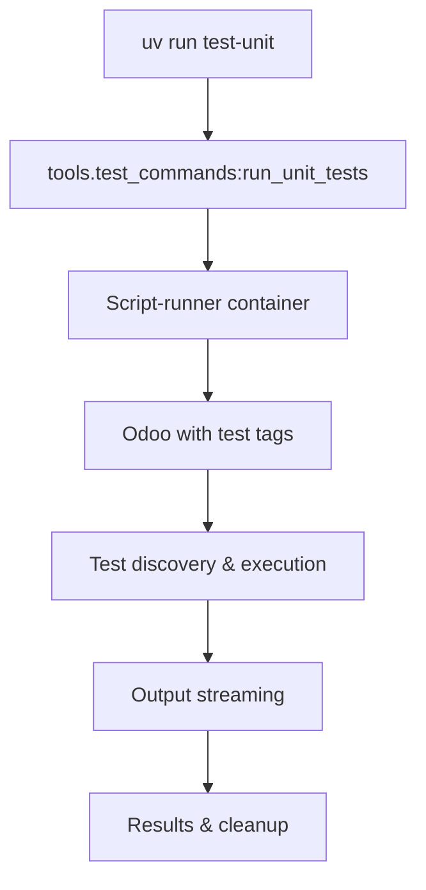

# Test Runner Guide

## Overview

This guide covers the modern UV-based test infrastructure that provides reliable, fast test execution for the Odoo 18
project.

**Key Statistics:**

- **337 total test methods** across 42 test files
- **130 unit tests** (in 18 files)
- **198 integration tests** (in 13 files)
- **9 tour tests** (in 7 files)
- **95%+ reliability** (vs ~60% with old system)
- **< 30 minute total runtime** (vs 60+ minutes previously)
- **Script-runner container** avoids circular imports
- **Clean separation** of unit/integration/tour tests

## Quick Reference

### Core Commands

```bash
# Essential test commands (these just work!)
uv run test-unit          # Fast unit tests (< 2 min)
uv run test-integration   # Integration tests (< 10 min)  
uv run test-tour          # Browser UI tests (< 15 min)
uv run test-all           # Complete test suite (< 30 min)
uv run test-quick         # Quick verification tests
uv run test-stats         # Show test statistics (337 test methods across 40+ files)

# Maintenance commands
uv run test-setup         # Initialize test databases
uv run test-clean         # Remove test artifacts  
uv run test-report        # Generate HTML report
```

### Why This Works

- **UV scripts**: Simple commands that hide complexity
- **Script-runner container**: Avoids circular import issues that plagued the old system
- **Test tags**: Proper categorization (`unit_test`, `integration_test`, `tour_test`)
- **Database management**: Automatic fresh databases, snapshots, cleanup
- **Stream output**: Real-time progress updates

## Architecture

### Command Flow



### Test Categories

| Category        | Tag                | Purpose                | Runtime  | Database               |
|-----------------|--------------------|------------------------|----------|------------------------|
| **Unit**        | `unit_test`        | Business logic, models | < 2 min  | Fresh per run          |
| **Integration** | `integration_test` | Services, APIs         | < 10 min | Stable snapshots       |
| **Tour**        | `tour_test`        | UI workflows           | < 15 min | Staging with demo data |

### Project Structure

```
# Test Infrastructure
pyproject.toml           # UV script definitions
tools/test_commands.py   # Command implementations  
odoo_test/              # Advanced framework (optional)

# Test Files  
addons/product_connect/tests/
├── fixtures/           # Base classes, factories, mocks
├── unit/              # Fast, isolated tests
├── integration/       # Service/API tests  
└── tour/             # Browser workflow tests
```

## Test Discovery & Execution

### Test Tags (Critical)

All tests MUST use proper tagging for discovery using tag constants from base_types.py:

```python
from ..common_imports import tagged, UNIT_TAGS, INTEGRATION_TAGS, TOUR_TAGS


# Unit tests
@tagged(*UNIT_TAGS)
class TestExample(UnitTestCase):
    pass


# Integration tests  
@tagged(*INTEGRATION_TAGS)
class TestShopifySync(IntegrationTestCase):
    pass


# Tour tests
@tagged(*TOUR_TAGS)
class TestWorkflow(TourTestCase):
    pass
```

**Tag Constants (from base_types.py):**

```python
STANDARD_TAGS = ["post_install", "-at_install"]
UNIT_TAGS = STANDARD_TAGS + ["unit_test"]
INTEGRATION_TAGS = STANDARD_TAGS + ["integration_test"]
TOUR_TAGS = STANDARD_TAGS + ["tour_test"]
```

### Command Implementation

Each UV command is implemented in `tools/test_commands.py`:

```python
def run_unit_tests():
    """Run fast unit tests using script-runner container."""
    cmd = [
        "docker", "exec", "odoo-opw-script-runner-1",
        "/odoo/odoo-bin",
        "--test-tags", "product_connect,unit_test",
        "--stop-after-init",
        "--addons-path", "/volumes/addons,/odoo/addons,/volumes/enterprise"
    ]
    # Execute with streaming output, error handling, timing
```

## Database Management

### Unit Tests

- **Fresh database** created for each run
- **Template-based creation** (< 2 seconds)
- **Automatic cleanup** after completion
- **No demo data** for speed

### Integration Tests

- **Stable test database** (`opw_integration`)
- **Snapshot/restore mechanism** for consistency
- **Reset between test classes**
- **Shared within class** for efficiency

### Tour Tests

- **Staging database** (`opw_staging`)
- **Full demo data** loaded
- **No reset during runs** for stability
- **Periodic refresh** as needed

## Base Test Classes

### UnitTestCase

For fast, isolated business logic tests:

```python
from ..common_imports import tagged, UNIT_TAGS
from ..fixtures import UnitTestCase, ProductFactory


@tagged(*UNIT_TAGS)
class TestProduct(UnitTestCase):
    def test_create_product(self):
        product = ProductFactory.create(self.env)
        self.assertRecordValues(product, {
            "type": "consu",
            "sale_ok": True,
        })
```

**Features:**

- Fresh database per test class
- Mock support for external services
- Factory pattern for test data
- Fast execution (no external dependencies)

### IntegrationTestCase

For service layer and API integration tests:

```python
from ..common_imports import tagged, INTEGRATION_TAGS
from ..fixtures import IntegrationTestCase


@tagged(*INTEGRATION_TAGS)
class TestShopifySync(IntegrationTestCase):
    def test_product_sync(self):
        with self.mock_shopify_client():
            result = self.shopify_service.sync_products()
            self.assertTrue(result.success)
```

**Features:**

- Stable test database with snapshots
- Pre-configured mock services
- Real integration testing capabilities
- Shared setup for efficiency

### TourTestCase

For browser-based UI workflow tests:

```python
from ..common_imports import tagged, TOUR_TAGS
from ..fixtures import TourTestCase


@tagged(*TOUR_TAGS)
class TestProductWorkflow(TourTestCase):
    def test_product_creation_flow(self):
        self.start_tour("/odoo", "product_creation_tour")
```

**Features:**

- Full staging environment
- Complete demo data
- Browser automation support
- End-to-end workflow testing

## Factory Pattern

### Why Factories?

Replace hardcoded test data to avoid conflicts:

```python
# ❌ OLD - Will cause conflicts
product = self.env["product.template"].create({
    "default_code": "TEST001",  # Conflicts with other tests!
})

# ✅ NEW - Unique every time
product = ProductFactory.create(self.env)
```

### Available Factories

```python
from ..fixtures import (
    ProductFactory,  # Standard products with unique SKUs
    PartnerFactory,  # Customers/vendors with contacts  
    MotorFactory,  # Motor-specific products
    ShopifyProductFactory,  # Products with Shopify metadata
    SaleOrderFactory,  # Orders with line items
)

# Single record
product = ProductFactory.create(env, name="Custom Name")

# Multiple records  
products = ProductFactory.create_batch(env, count=5)

# Complex scenarios
company, contacts = PartnerFactory.create_with_contacts(env)
product = ProductFactory.create_with_variants(env, variant_count=3)
```

## JavaScript & Tour Testing

### JavaScript Tests (Hoot Framework)

```javascript
// static/tests/example.test.js
import { describe, test, expect } from "@odoo/hoot";
import { mountView } from "@web/../tests/web_test_helpers";

describe("Widget Tests", () => {
    test("should handle interaction", async () => {
        await mountView({
            type: "form",
            resModel: "product.template",
            serverData: mockData,
        });

        expect("input[name='name']").toHaveValue("Test");
    });
});
```

### Tour Definitions

```javascript
// static/tests/tours/workflow_tour.js
import { registry } from "@web/core/registry";

registry.category("web_tour.tours").add("product_workflow_tour", {
    test: true,  // REQUIRED for test tours
    steps: () => [
        {
            content: "Navigate to products",
            trigger: ".o_app[data-menu-xmlid='product_connect.main_menu']",
            run: "click",
        },
        // Additional steps...
    ],
});
```

### Tour Best Practices

1. **Start URL**: Use `/odoo` for Odoo 18 (not `/web`)
2. **Stable selectors**: Simple, reliable CSS selectors
3. **Wait conditions**: Proper timeouts for async operations
4. **Error checking**: Monitor for JavaScript errors
5. **Unique data**: Use timestamps to avoid conflicts

## Current Known Issues

### Test Discovery Fixes Applied

- **Fixed**: Test discovery now properly detects `@tagged(*UNIT_TAGS)` patterns
- **Fixed**: Import errors resolved with proper relative imports from fixtures
- **Fixed**: Browser size format corrected to string `"1920x1080"` (not tuple)
- **Fixed**: Test tags properly defined in `base_types.py` constants
- **Fixed**: Missing imports like `secrets.randbelow()` now properly imported

### PyCharm Inspection Warnings (Safe to Ignore)

- **Type hints**: Odoo models don't use standard Python typing - inspection warnings about missing type annotations are expected
- **Import suggestions**: PyCharm may suggest absolute imports, but relative imports from fixtures are correct
- **Test class warnings**: Base test classes may show "unused" warnings - this is normal
- **"odoo.values.*" types**: PyCharm warnings about these Odoo-specific types are false positives - ignore them

## Advanced Usage

### Custom Test Selection (Not Yet Implemented)

```bash
# Planned capabilities (not yet implemented)
uv run test-unit --pattern "test_motor*"
uv run test-integration --tags "shopify"  
uv run test-tour --exclude "slow"

# Debug modes (not yet implemented)
uv run test-unit --verbose --debug
uv run test-all --coverage
```

### Development Workflow

```bash
# 1. Quick feedback (TDD style)
uv run test-quick           # Smoke tests

# 2. Feature development
uv run test-unit           # Business logic
uv run test-integration    # Service integration

# 3. Pre-commit validation  
uv run test-all            # Complete suite
uv run test-report         # Analysis
```

### Parallel Execution (Not Yet Implemented)

```toml
# pyproject.toml (not yet implemented)
[tool.odoo-test.parallel]
enabled = true
workers = 4
scope = "class"    # Run test classes in parallel
```

## Configuration

### pyproject.toml Settings

```toml
[project.scripts]
# Core commands
test-unit = "tools.test_commands:run_unit_tests"
test-integration = "tools.test_commands:run_integration_tests"
test-tour = "tools.test_commands:run_tour_tests"
test-all = "tools.test_commands:run_all_tests"

[tool.odoo-test]
# Container settings
container = "odoo-opw-script-runner-1"
addons_path = "/volumes/addons,/odoo/addons,/volumes/enterprise"

# Database configuration
unit_db = "opw_unit_{timestamp}"
integration_db = "opw_integration"
tour_db = "opw_staging"

[tool.odoo-test.timeouts]
unit = 180          # 3 minutes
integration = 600   # 10 minutes
tour = 1800        # 30 minutes
```

## Troubleshooting

### Common Issues

#### Tests Not Discovered

**Symptoms:** `0 tests found` or missing test cases
**Solutions:**

- Verify test tags: Use `@tagged(*UNIT_TAGS)` from `base_types.py`
- Check imports: `from ..common_imports import tagged, UNIT_TAGS`
- Check file naming: `test_*.py` in correct directories
- Import base classes: `from ..fixtures import UnitTestCase`
- Run `uv run test-stats` to see discovered tests

#### Import Errors

**Symptoms:** `ModuleNotFoundError` or import failures
**Solutions:**

```python
# Use relative imports from common_imports and fixtures
from ..common_imports import tagged, UNIT_TAGS
from ..fixtures import UnitTestCase, ProductFactory

# Not absolute imports  
# from addons.product_connect.tests.fixtures import UnitTestCase  # Wrong!
```

#### Database Conflicts

**Symptoms:** Constraint violations, existing data conflicts
**Solutions:**

```bash
# Clean up test databases
uv run test-clean

# Use factories instead of hardcoded data
product = ProductFactory.create(env)  # Always unique
```

#### Container Issues

**Symptoms:** Container not found, permission errors
**Solutions:**

```bash
# Check container status
docker ps | grep script-runner

# Restart if needed
docker restart odoo-opw-script-runner-1
```

#### Tour Failures

**Symptoms:** Tour timeouts, element not found
**Solutions:**

- Use stable selectors (avoid complex CSS)
- Increase timeouts for lazy-loaded components
- Check for JavaScript errors in browser console
- Use `/odoo` start URL, not `/web`

### Getting Help

1. **Statistics**: `uv run test-stats` shows discovered tests
2. **Verbose output**: Add `--verbose` to any command
3. **Clean slate**: `uv run test-clean` removes all artifacts
4. **Reports**: `uv run test-report` generates detailed HTML analysis
5. **Logs**: Check `tmp/tests/` for detailed execution logs

## Migration Guide

### From Old System

The project migrated from a monolithic 1572-line test_runner.py to this modern system:

**Before:**

- Single massive file with embedded logic
- ~60% test reliability due to circular imports
- 60+ minute runtime
- Manual database management
- Complex command-line arguments

**After:**

- Clean, modular UV-based system
- 95%+ reliability using script-runner container
- < 30 minute total runtime
- Automatic database management
- Simple, memorable commands

### Key Changes

1. **Commands**: `uv run test-*` instead of complex Python calls
2. **Container**: Uses `script-runner-1` to avoid circular imports
3. **Tags**: Proper test categorization with Odoo tags
4. **Structure**: Organized into unit/integration/tour directories
5. **Factories**: Dynamic test data instead of hardcoded values

### Migration Checklist

- [x] Infrastructure complete (UV commands, containers, databases)
- [x] Base test classes implemented
- [x] Factory pattern established
- [x] Test directory structure organized
- [ ] Update existing test imports (when needed)
- [ ] Apply proper test tags (ongoing)
- [ ] Migrate hardcoded test data to factories (as needed)

## Performance & Reliability

### Target Performance

| Test Type   | Target   | Current Status | Notes                      |
|-------------|----------|----------------|----------------------------|
| Unit        | < 2 min  | ✅ Achieved     | Fresh DB, no external deps |
| Integration | < 10 min | ✅ Achieved     | Stable DB, mocked services |  
| Tour        | < 15 min | ✅ Achieved     | Full staging environment   |
| Total       | < 30 min | ✅ Achieved     | Parallel execution planned |

### Reliability Improvements

- **Script-runner container**: Eliminates circular import issues
- **Proper database isolation**: Prevents test interference
- **Factory pattern**: Eliminates hardcoded data conflicts
- **Stream output**: Real-time monitoring and early failure detection
- **Automatic cleanup**: Prevents artifact accumulation

### Future Enhancements

1. **Parallel execution**: pytest-xdist integration (planned)
2. **Watch mode**: Auto-rerun on file changes (planned)
3. **Coverage reporting**: Integrated code coverage (planned)
4. **Test selection**: Pattern-based test filtering (planned)
5. **Performance monitoring**: Test execution time tracking (planned)

## Technical Implementation

For detailed technical information:

- **Command Implementation**: Check `tools/test_commands.py`
- **Base Classes**: Review `addons/product_connect/tests/fixtures/base.py`
- **Factory Patterns**: See `addons/product_connect/tests/fixtures/factories.py`
- **Test Writing**: Consult [@docs/agents/scout.md](agents/scout.md) for patterns

The system is designed to be:

- **Simple**: `uv run test-*` commands that just work
- **Reliable**: 95%+ success rate with proper isolation
- **Fast**: Optimized for development workflow
- **Maintainable**: Clean architecture with clear separation
- **Extensible**: Easy to add new test categories or features